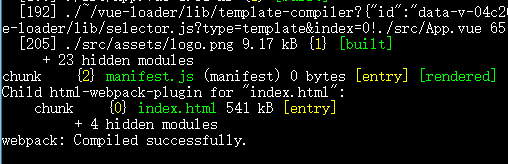

# Vue 组件库 Element 脚手架 入门教程

> 前提是安装了nodejs（6.0+），npm
> 验证安装成功  node --version
> npm --version


Element官网地址：
[http://element-cn.eleme.io/#/zh-CN](http://element-cn.eleme.io/#/zh-CN)

Element 脚手架 代码git地址：
[https://github.com/ElementUI/element-starter.git](https://github.com/ElementUI/element-starter.git)

git clone下来后，进入element-starter目录

---

首先文档上写明了需要安装yarn


所以执行
```
 npm install -g yarn
```

命令进行全局安装。
关于yarn的说明请看[yarn的安装与使用 - CSDN博客](https://blog.csdn.net/guoquanyou/article/details/61199935)

---

- 命令行进入element-starter目录下，执行：
```
npm install
```
等待初始化完成

- 然后再执行
```
npm run dev
```
出现下面的提示即说明成功


然后根据提示，在浏览器打开 [http://127.0.0.1:8010](http://127.0.0.1:8010)

会出现下面的页面


---

对应的代码为，在src目录下的App.vue文件，

```
<template>
  <div id="app">
    
    <div>
      <el-button @click="startHacking">Start</el-button>
    </div>
  </div>
</template>

<script>
export default {
  methods: {
    startHacking () {
      this.$notify({
        title: 'It works!',
        type: 'success',
        message: 'We\'ve laid the ground work for you. It\'s time for you to build something epic!',
        duration: 5000
      })
    }
  }
}
</script>

<style>
#app {
  font-family: Helvetica, sans-serif;
  text-align: center;
}
</style>
```

---

### 开始写一个自己的页面

这里要用到路由，所以需要执行下面的命令安装一下
```
npm install vue-router --save
```

- 修改App.vue文件，添加一个路由的标签

```
<template>
  <div id="app">
    <transition name="fade" mode="out-in">
	     <router-view></router-view>
	</transition>
  </div>
</template>

<script>
export default {
  methods: {
    startHacking () {
      this.$notify({
        title: 'It works!',
        type: 'success',
        message: 'We\'ve laid the ground work for you. It\'s time for you to build something epic!',
        duration: 5000
      })
    }
  }
}
</script>

<style>
#app {
  font-family: Helvetica, sans-serif;
  text-align: center;
}
</style>
```

- 在src目录下的新建一个名为 `routes.js` 的文件，内容如下：

```
import Login from './views/Login.vue'

let routes = [
    {
        path: '/login',
        component: Login,
        name: '',
        hidden: true
    }
];

export default routes;
```

- 在src目录下的新建一个名为 `views` 的文件夹，在该文件夹下再新建一个名为`Login.vue`的文件，内容如下：

```
<template>

  <el-form :model="ruleForm2" :rules="rules2" ref="ruleForm2" label-position="left" label-width="0px" class="demo-ruleForm login-container">
    <h3 class="title">系统登录</h3>
    <el-form-item prop="account">
      <el-input type="text" v-model="ruleForm2.account" auto-complete="off" placeholder="账号"></el-input>
    </el-form-item>
    <el-form-item prop="checkPass">
      <el-input type="password" v-model="ruleForm2.checkPass" auto-complete="off" placeholder="密码"></el-input>
    </el-form-item>
    <el-checkbox v-model="checked" checked class="remember">记住密码</el-checkbox>
    <el-form-item style="width:100%;">
      <el-button type="primary" style="width:100%;" @click.native.prevent="handleSubmit2" :loading="logining">登录</el-button>
      <!--<el-button @click.native.prevent="handleReset2">重置</el-button>-->
    </el-form-item>
  </el-form>
</template>

<script>

  export default {
    data() {
      return {
        logining: false,
        ruleForm2: {
          account: 'admin',
          checkPass: '123456'
        },
        rules2: {
          account: [
            { required: true, message: '请输入账号', trigger: 'blur' },
            //{ validator: validaePass }
          ],
          checkPass: [
            { required: true, message: '请输入密码', trigger: 'blur' },
            //{ validator: validaePass2 }
          ]
        },
        checked: true
      };
    },
    methods: {
      handleReset2() {
        this.$refs.ruleForm2.resetFields();
      },
      handleSubmit2(ev) {
        var _this = this;
        this.$refs.ruleForm2.validate((valid) => {

        });
      }
    }
  }

</script>
<style >
  .login-container {
    -webkit-border-radius: 5px;
    border-radius: 5px;
    -moz-border-radius: 5px;
    background-clip: padding-box;
    margin: 180px auto;
    width: 350px;
    padding: 35px 35px 15px 35px;
    background: #fff;
    border: 1px solid #eaeaea;
    box-shadow: 0 0 25px #cac6c6;
    .title {
      margin: 0px auto 40px auto;
      text-align: center;
      color: #505458;
    }
    .remember {
      margin: 0px 0px 35px 0px;
    }
  }
</style>
```

- 最后修改 `main.js`文件，

```
import Vue from 'vue'
import ElementUI from 'element-ui'
import 'element-ui/lib/theme-chalk/index.css'
import App from './App.vue'

import VueRouter from 'vue-router'
import routes from './routes'

Vue.use(ElementUI)
Vue.use(VueRouter)

const router = new VueRouter({
  routes
})

new Vue({
  router,
  el: '#app',
  render: h => h(App)
})

```

- 执行
```
npm run dev
```
启动完毕后，在浏览器输入[http://127.0.0.1:8010/#/login](http://127.0.0.1:8010/#/login)

即可看到下面的页面


### 打包
```
npm run build
```
在src同级目录下会生成一个名为`dist`的文件夹，


打开index.html，后面跟上#/login即可看到手写的页面

---


---
---
